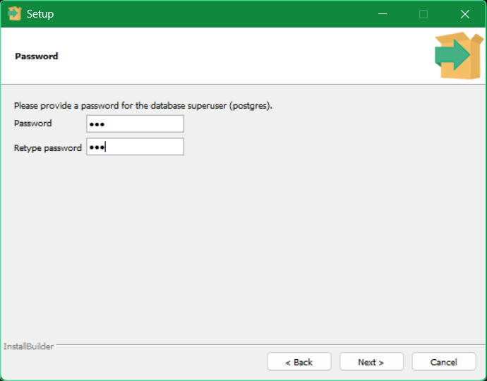
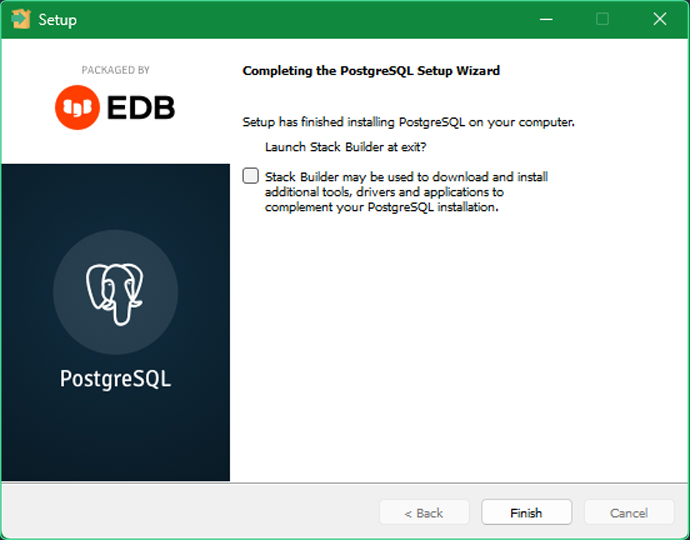
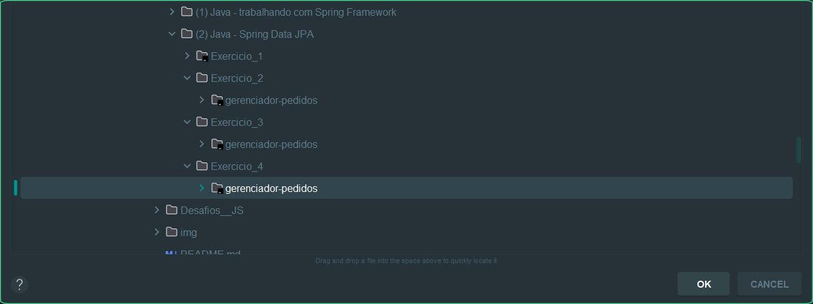
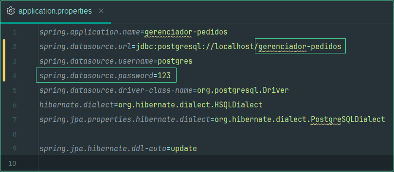
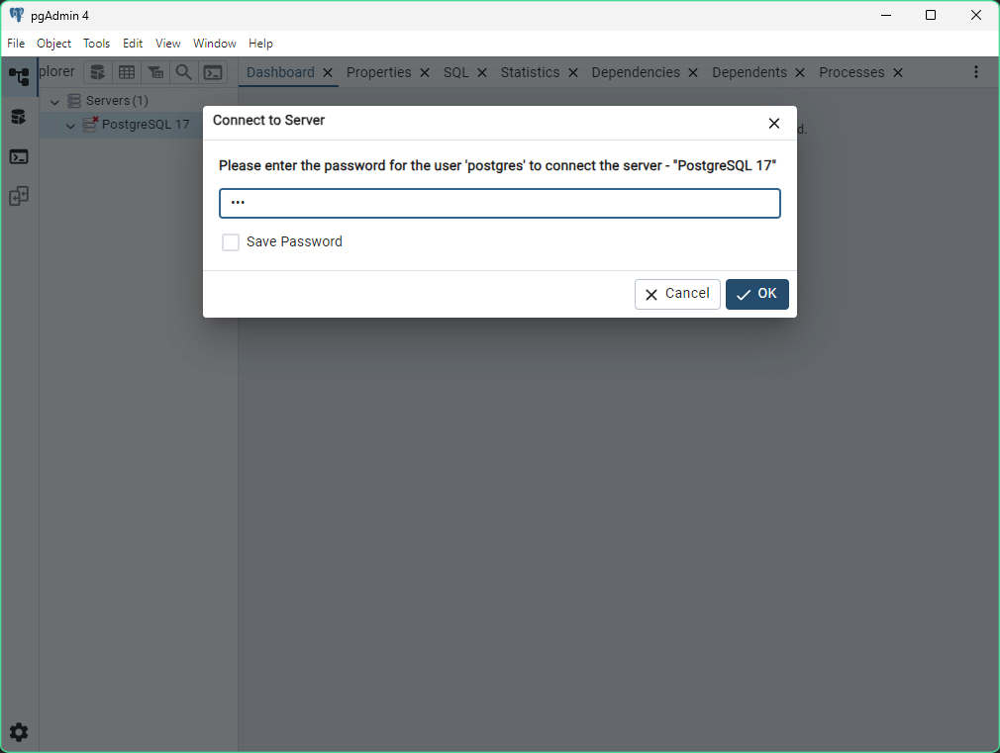
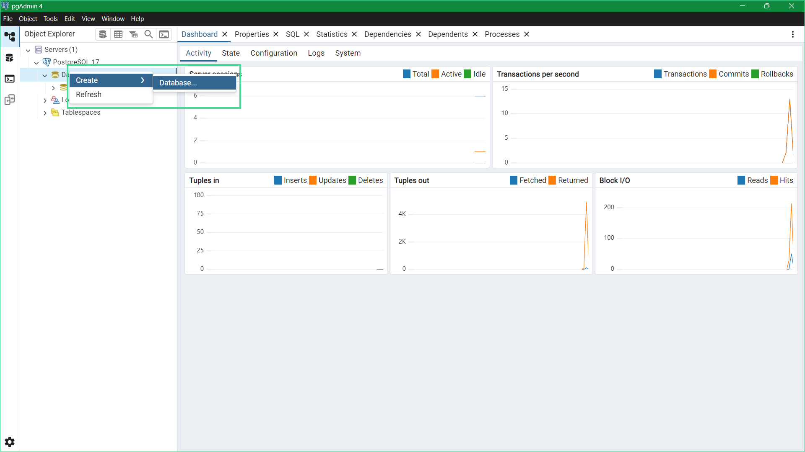
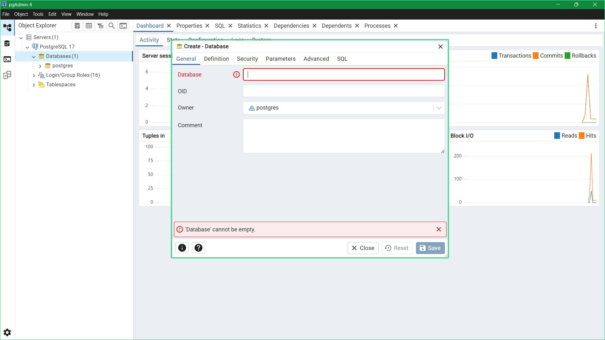
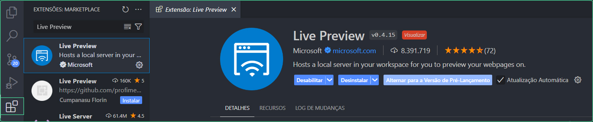
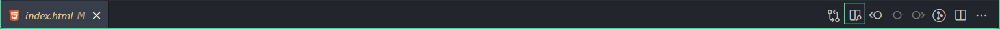

# 📱 Screen-Match

## 📰 Descrição

Projeto trabalhado durante a primeira e a segunda formação de Java na Alura

Esse projeto simula um serviço de streaming de filmes e séries, que **exibem suas respectivas informações (nome do título, ano de lançamento, duração, nota...)**

> Esse projeto utiliza da <a href = "https://www.omdbapi.com/">API da "OMDb"</a>, que permite uma **pesquisa mais precisa e "real"** dos filmes e séries 
> * Utilizando agora da **biblioteca JSON "Jackson"**, o projeto apresenta conceitos de **lambdas e streams** para gerar fluxos de dados
> * O projeto agora também utiliza da <a href = "https://mymemory.translated.net/">API da "MyMemory"</a>, uma API que **traduz a sinopse vinda da "OMDb"**
> * Adicionalmente, o projeto apresenta **conexão com banco de dados Postgres e consultas utilizando Spring Data JPA** 
> * Agora, também, o projeto apresenta **uma aplicação front-end (utilizando do Spring Web)** 
>   * Em adição a isso, foram feitas algumas **alterações opcionais às páginas,** como: **página de "Categorias" exibe o seu título de acordo com a categoria,** melhor organização do código, diferentes links de redirecionamento...

## 💻 Tecnologias Utilizadas
`Trabalhado durante o curso:`

    

`Modificado para novas implementações OPCIONAIS:`

   

`Desenvolvido anteriormente pela Alura:`

   

## 🛠️ Como executar o programa 

* Passo 1: Instale <a href = "https://www.enterprisedb.com/downloads/postgres-postgresql-downloads">a versão mais recente do Postgres</a>

* Passo 2: Durante a instalação, **coloque a senha *"123" (ou outra senha fácil)***
  * Você pode **desmarcar a opção de inicializar o "Stack Builder" no final da instalação**

- Passo 3: Baixe o ZIP do projeto ***(escolha a versão em "Releases" ou apenas clique em "Code")*** e descompacte a pasta

- Passo 4: Abra o projeto utilizando a <a href = "https://www.jetbrains.com/pt-br/idea/">IDE do Intellij</a> e clique em **"Setup SDK"**

- Passo 5: Clique em **"Download JDK"**

- Passo 6: Instale a versão mais recente (ou, em caso de problemas, ***instale a versão demonstrada na imagem***)

- Passo 7: Agora, dentro de ***src/main/resources/application.properties,*** copie o nome do banco de dados *(e mude a senha, caso tenha alterado)*

* Passo 8: Abrindo o **Postgres**, **insira a senha** e, clicando com o botão direito nos "databases", crie um novo banco de dados **com o nome copiado anteriormente**

- Passo 9: Após isso, abra o projeto com o <a href = "https://code.visualstudio.com/">Visual Studio Code</a> e **instale a extensão do "Live Preview"**

- Passo 10: Abra o **"index.html"** com o Live Preview *(demonstração na imagem)*

- Passo 11: Após isso, volte ao Intellij e **procure a classe principal para executar o programa**

## 🏅 Certificado de Conclusão 

 

## 🙋 Autores
[    Gabriel Possato ](https://github.com/possatogabriel)
 
 

    
