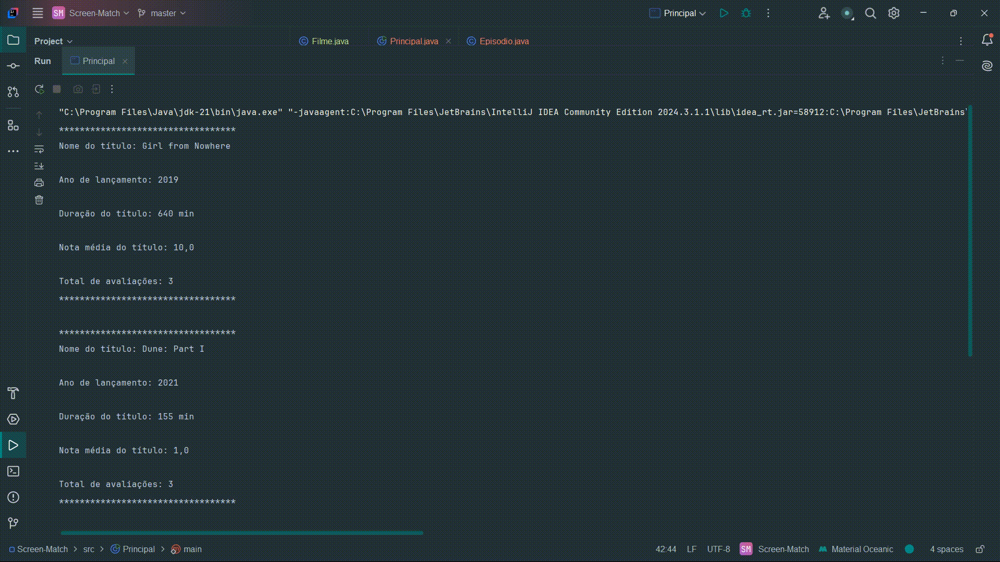
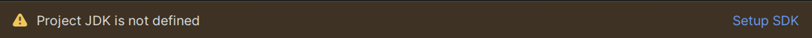
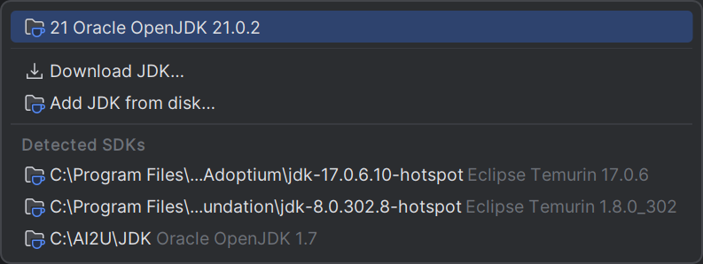
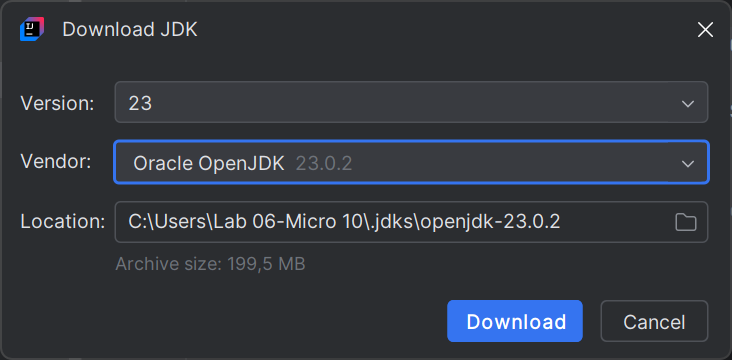
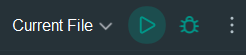

# 📱 Screen-Match

## 📰 Descrição

Projeto trabalhado durante a primeira e a segunda formação de Java na Alura

Esse projeto simula um serviço de streaming de filmes e séries, que **exibem suas respectivas informações (nome do título, ano de lançamento, duração, nota...)**

> Esse projeto utiliza da <a href = "https://www.omdbapi.com/"> API da "OMDb", </a> que permite uma **pesquisa mais precisa e "real"** dos filmes e séries 
> - Utilizando agora da **Spring Framework** e da **biblioteca JSON "Jackson"**, o projeto apresenta conceitos de **lambdas e streams** para gerar fluxos de dados

## 💻 Tecnologias Utilizadas
`Trabalhado durante o curso:`

   

## 💾 Como executar o programa

- Passo 1: Utilize a IDE da sua preferência (por exemplo, a IDE do <a href = "https://www.jetbrains.com/pt-br/idea/"> Intellij, </a> como mostrado no exemplo) 

- Passo 2: Clique em **"Setup JDK"**

- Passo 3: Clique em **"Download JDK"**

- Passo 4: Instale a versão mais recente

- Passo 5: Após a instalação, procure a classe principal ***(ScreenmatchApplication)*** e execute o programa

## 🏅 Certificado de Conclusão 

 

## 🙋 Autores
[    Gabriel Possato ](https://github.com/possatogabriel)
 
 

    
