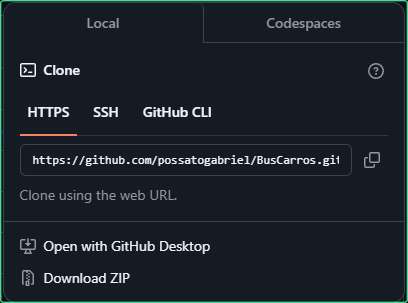
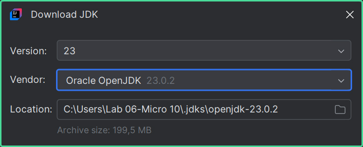

# 📱 Screen-Match

## 📰 Descrição

Projeto trabalhado durante a primeira e a segunda formação de Java na Alura

Esse projeto simula um serviço de streaming de filmes e séries, que **exibem suas respectivas informações (nome do título, ano de lançamento, duração, nota...)**

> * Esse projeto utiliza da <a href = "https://www.omdbapi.com/">API da "OMDb"</a>, que permite uma **pesquisa mais precisa e "real"** dos filmes e séries 
> * Utilizando agora da **biblioteca JSON "Jackson"**, o projeto apresenta conceitos de **lambdas e streams** para gerar fluxos de dados
> * O projeto agora também utiliza da <a href = "https://mymemory.translated.net/">API da "MyMemory"</a>, uma API que **traduz a sinopse vinda da "OMDb"**
>   * Opcionalmente, também, fiz um **menu** para a aplicação 

## 💻 Tecnologias Utilizadas
`Trabalhado durante o curso:`

   

## 🛠️ Como executar o programa 

- Passo 1: Baixe o ZIP do projeto ***(escolha a versão em "Releases" ou apenas clique em "Code")*** e descompacte a pasta

- Passo 2: Abra o projeto utilizando a <a href = "https://www.jetbrains.com/pt-br/idea/">IDE do Intellij</a> e clique em **"Setup SDK"**

- Passo 3: Clique em **"Download JDK"**

- Passo 4: Instale a versão mais recente (ou, em caso de problemas, ***instale a versão demonstrada na imagem***)

- Passo 5: Após a instalação, procure a classe principal ***(Main)*** e execute o programa

## 🏅 Certificado de Conclusão 

 

## 🙋 Autores
[    Gabriel Possato ](https://github.com/possatogabriel)
 
 

    
