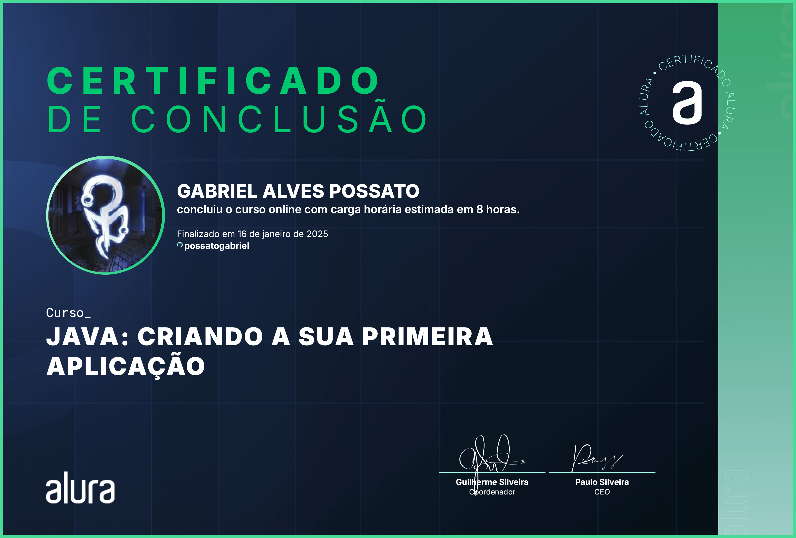
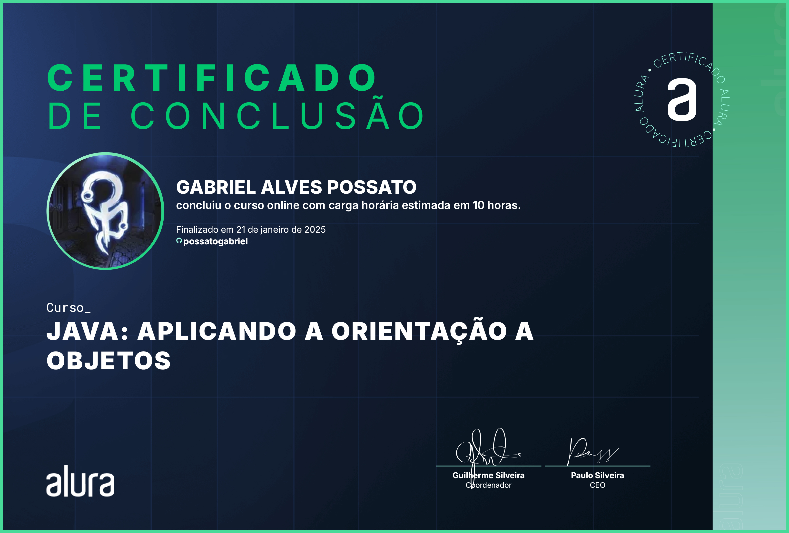
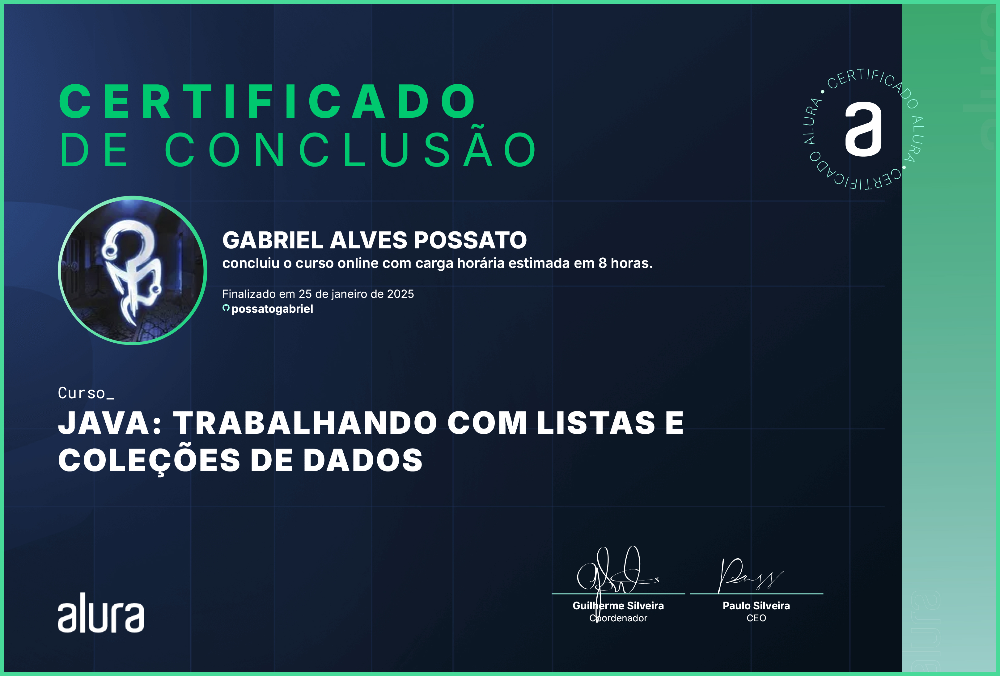
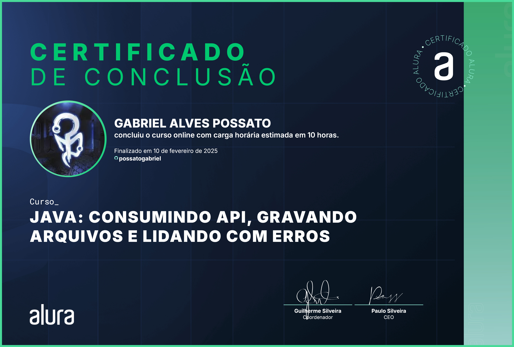

# 📱 Screen-Match

## 📰 Descrição

Projeto trabalhado durante a primeira formação de Java na Alura

Esse projeto simula um serviço de streaming de filmes e séries, que **exibem suas respectivas informações (nome do título, ano de lançamento, duração, nota...)**

> Esse projeto utiliza da <a href = "https://www.omdbapi.com/"> API da "OMDb", </a> que permite uma **pesquisa mais precisa e "real"** dos filmes e séries 

## 💻 Tecnologias Utilizadas
`Trabalhado durante o curso:`

 
          
## 🏅 Certificado de Conclusão 

   

## 🙋 Autores
[    Gabriel Possato ](https://github.com/possatogabriel)
 
 

    
